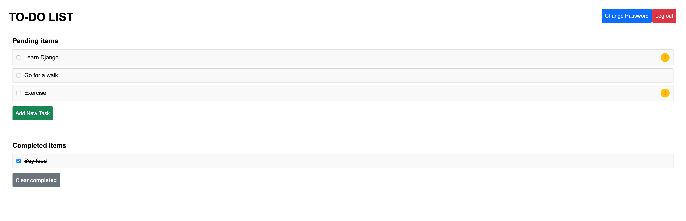

# Reminders

This is a simple to-do list app written in Django. This is still work in progress.

## Local development

1. Make sure you have Python 3.11 or higher and the poetry tool installed.
2. Clone this repository.
3. Navigate to the folder and run `poetry install`.
4. Run database migrations: `poetry run python manage.py migrate`.
5. Create a superuser: `poetry run python manage.py createsuperuser`.
6. Run `poetry run python manage.py runserver`.
7. Go to `http://127.0.0.1:8000/` to view the web app.
8. Log in using your superuser credentials.